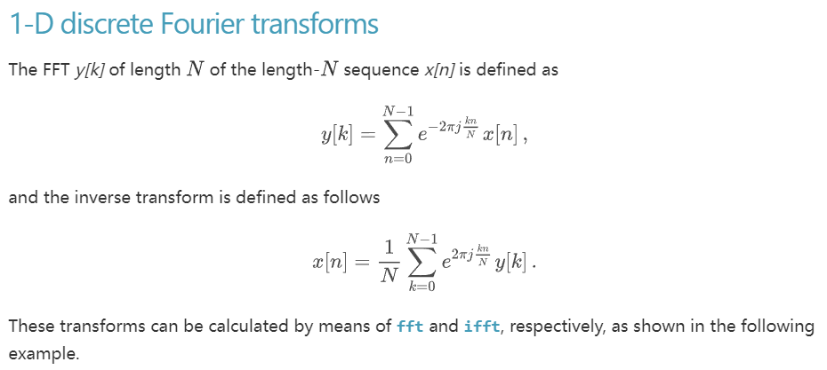
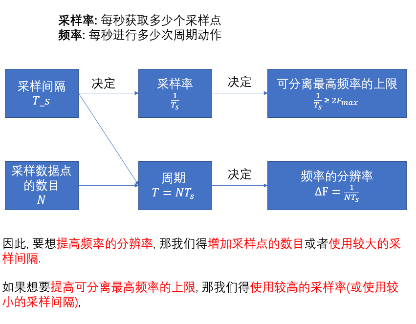

# 第一节, 三角函数的正交性

三角函数的标准形式为公式 2.1 所示

$$
f(t) = A \sin (\omega_t+\varphi)  \tag{2.1}
$$

其中,  
$t$ 为时间变量,  
$A$ 为波幅,  
$\omega$ 为角速度,  
$\varphi$ 为相位,  
我们可以通过公式2.2求得这个正弦波的频率.

$$
f=\frac{\omega}{2 \pi}  \tag{2.2}
$$
176-735-650

并由式2.2可知, 角速度和正弦波的频率是正相关的.

同时, 因为三角函数是周期函数, 其在 $-\pi$ 到 $\pi$ 的积分必定为 0, 由此性质可写出式 $2.3$, $2.4$
$$
\int_{-\pi}^\pi \sin (\mathrm{nx}) d x=0 \tag{2.3}
$$
$$
\int_{-\pi}^\pi \cos (\mathrm{nx}) d x=0 \tag{2.4}
$$
设某三角函数为
$$
f(x)=\sin (n x) \tag{2.5}
$$
在式 $2.5$ 两边同时乘以 $\sin (\mathrm{mx})$ 同时,对两边在 $-\pi$ 到 $\pi$ 内进行积分, 得出
$$
\int_{-\pi}^\pi f(x) \sin (m x) d x=\int_{-\pi}^\pi \sin (\mathrm{nx}) \sin (m x) d x \tag{2.6}
$$
由三角函数的积化和差公式,上式可变形为
$$
\begin{aligned}
& \int_{-\pi}^\pi f(x) \sin (m x) \mathrm{dx}=\frac{1}{2} \int_{-\pi}^\pi \cos [(m-n) x]-\cos [(m+n) x] \mathrm{dx}=\frac{1}{2} \\
& \int_{-\pi}^\pi \cos [(m-n) x] \mathrm{dx}-\frac{1}{2} \int_{-\pi}^\pi \cos [(m+n) x] \mathrm{dx} \tag{2.7}
\end{aligned}
$$
依据上述推导方法我们可以继续推导出下列公式:
$$
\begin{aligned}
& \int_{-\pi}^\pi \cos (\mathrm{mx}) \cos (\mathrm{nx}) d x \\
&=\frac{1}{2} \int_{-\pi}^\pi \cos [(m-n) x]+\cos [(m+n x)] \mathrm{dx} \\
&=\frac{1}{2}  \int_{-\pi}^\pi \cos [(m-n) x] \mathrm{dx}+\frac{1}{2} \int_{-\pi}^\pi \cos [(m+n) x] \mathrm{dx} \tag{2.8}
\end{aligned}
$$
$$
\begin{aligned}
& \int_{-\pi}^\pi \sin (m \mathrm{x}) \cos (\mathrm{nx}) d x \\
&=\frac{1}{2} \int_{-\pi}^\pi \sin [(m-n) x]+\sin [(m+n) x] \mathrm{dx} \\
&=\frac{1}{2}\int_{-\pi}^\pi \sin [(m-n) x] \mathrm{dx}+\frac{1}{2} \int_{-\pi}^\pi \sin [(m+n) x] \mathrm{dx}  \tag{2.9}
\end{aligned}
$$
因为三角函数在- $\pi$ 到 $\pi$ 内的积分为 0 , 因此当 $m \neq n$ 时, 式 $2.7 、 2.8 、 2.9$ 的结果必定为 0, 因此可以得出以下结论, **频率不同的三角函数相乘在一个周期内 $(-\pi$ 到 $\pi)$ 的积分必定为 0.**

# 第二节 傅里叶级数推导

法国数学家傅里叶在提出傅里叶级数时认为，任何一个周期信号都可以展开成傅里叶级数，之后这个结论被进一步补充，只有在满足狄利克雷条件时，周期信号才能够被展开成傅里叶级数.
其中，狄利克雷条件的定义如下:

1. 在一周期内，连续或只有有限个第一类间断点.
2. 在一周期内，极大值和极小值的数目应是有限个.
3. 在一周期内，信号是绝对可积的.
   现假设一函数 $f(t)$ 由一个直流分量和若干余弦函数组成，如式2.10所示

> $$
> f(t)=c_0+\sum_{n=1}^{\infty} c_n \cos (n \omega t+\varphi) \tag{2.10}
> $$

利用三角函数的和差化积公式 上式可以进一步变形为

> $$
> f(t)=c_0+\sum_{n=1}^{\infty}\left[c_n \cos \varphi \cos (n \omega t)-c_n \sin \varphi \sin (n \omega t)\right]  \tag{2.11}
> $$

设 $a_n, b_n$ 为:

$$
a_n=c_n \cos \varphi \tag{2.12} 
$$

$$
b_n=-c_n \sin \varphi \tag{2.13}
$$

那么,式2.11可写作

> $$
> f(t)=c_0+\sum_{n=1}^{\infty}\left[a_n \cos (\mathrm{n} \omega \mathrm{t})+b_n \sin (\mathrm{n} \omega \mathrm{t})\right] \tag{2.14}
> $$

式2.14实际上即是傅里叶级数的展开式, 从上式可知,若要将一个周期信号展开为傅里叶级数形式,实 现上就是确定级数 $a_n b_n$ ，那么就下来我们讨论的就是如何求出 $a_n b_n$ .
在式2.14的两边同时乘以一个 $\sin (\mathrm{k} \omega \mathrm{t})$, 并对它们在一个周期内进行积分,那么就有

$$
\begin{aligned}
& \int_0^T f(t) \sin (\mathrm{k} \omega \mathrm{t}) d t \\
&=\int_0^T c_0 \sin (\mathrm{k} \omega \mathrm{t}) \mathrm{dt} \\
&+ \int_0^T \sin (\mathrm{k} \omega \mathrm{t}) \sum_{n=1}^{\infty}
\left[
    a_n \cos (\mathrm{n} \omega \mathrm{t})+
    b_n \sin (\mathrm{n} \omega \mathrm{t})
\right] \mathrm{dt} \tag{2.15}
\end{aligned}
$$

**根据第一节的推论，频率不同的三角函数相乘在一个周期内的积分必定为 0**, 因此，仅有 $k=n$ 时不为 0, 那么其中 $\int_0^T c_0 \sin (\mathrm{k} \omega \mathrm{t}) \mathrm{dt}$ 结果为 0,
$\int_0^T a_n \cos (\mathrm{n} \omega \mathrm{t}) \sin (\mathrm{k} \omega \mathrm{t}) \mathrm{dt}$ 结果也必定为 0 , 
因此上式可以进一步化简为
$$
\int_0^T f(t) \sin (\mathrm{k} \omega \mathrm{t}) d t=b_n \int_0^T \sin (\mathrm{n} \omega \mathrm{t})^2 d t=b_n \frac{T}{2} \\ \tag{2.16}
$$
因此,得出
$$
b_n=\frac{2}{T} \int_0^T f(t) \sin (\mathrm{n} \omega \mathrm{t}) \mathrm{dt} \tag{2.17}
$$
依照上述方法,同样可以计算出
$$
a_n=\frac{2}{T} \int_0^T f(t) \cos (\mathrm{n} \omega \mathrm{t}) \mathrm{dt} \tag{2.18}
$$
同时，通过以下公式可以得知傅里叶级数与波幅相位之间的关系
$$
c_n=\sqrt{a_n^2+b_n^2} \tag{2.19}
$$
$$
\varphi=\arctan \left(-\frac{b_n}{a_n}\right) \tag{2.20}
$$

# 第三节 复变函数到傅里叶级数

常用复数函数表达式:
$$
e^{j \theta}=\cos \theta+j \sin \theta \tag{3.0}
$$
其中公式中 $\mathrm{e}$ 是自然对数的底， $\mathrm{i}$ 是虚数单位.
该函数将晶数、指数函数与三角函数相互联系起来.如果定义一个㪚平面，其中以横坐标方向作为 实数方向，纵坐标方向作为虚数方向，担变函数实际上是一个绕原点旋转的一个圆，如图2.3.1:

由公式
$$
\theta=\omega t=\frac{2 \pi}{T} t \tag{3.1}
$$
可知，该复变函数可以看做是一个角速度为 $\omega$, 周期为 $T$ 在复平面上绕原点旋转的半径为 1 的圆.
将公式代回到复变函数中，那么，是变函数可以写成公式3.2的形式
$$
e^{\mathrm{j} \omega t}=\cos \omega t+j \sin \omega t \tag{3.2}
$$
设一组三角函数，其频率是 $\cos \omega t$ 的n倍，其中 $n$ 是大于 0 的正整数，那么可以定义这一组三角函 数为:
$$
\begin{aligned}
& \cos (\mathrm{nwt})=\frac{e^{\mathrm{j} w \mathrm{i}}+e^{-\mathrm{j} \omega t}}{2}(3.3) \\
& \sin (\mathrm{nwt})=\frac{e^{\mathrm{j} \omega \mathrm{t}}-e^{-\mathrm{m} \omega \mathrm{t} t}}{2 j}(3.4)
\end{aligned}
$$
将公式3.3与3.4代回到式2.14中，可得到如下公式
进一步化简可以得到:
$$
f(t)=c_0+\sum_{n=1}^{\infty}\left[\frac{\left(a_n-j b_n\right)}{2} e^{j n \omega t}+\frac{\left(a_n+j b_n\right)}{2} e^{-j n \omega t}\right](3.26)
$$
因为
$$
\begin{aligned}
& a_{-n}=\frac{2}{T} \int_0^T f(t) \cos (-n \omega t) \mathrm{dt}=a_n \\
& b_{-n}=\frac{2}{T} \int_0^T f(t) \sin (-n \omega t) d t=-b_n
\end{aligned}
$$
因此，上式可变为
$$
f(t)=c_0+\sum_{n=1}^{\infty}\left[\frac{\left(a_n-j b_n\right)}{2} e^{j n \omega t}+\frac{\left(a_{-n}-j b_{-n}\right)}{2} e^{-j n \omega t}\right](3.29)
$$
即
$$
f(t)=c_0+\sum_{n=1}^{\infty} \frac{\left(a_n-j b_n\right)}{2} e^{j n \omega t}+\sum_{-\infty}^{-1} \frac{\left(a_n-j b_n\right)}{2} e^{j n \omega t}
$$

这里注意一点 $c_0$ 为直流分量，对应频率为 0 的情况, 即 $c_0$ 为 $n=0$ 的情况

> $$
> f(t)=\sum_{n=-\infty}^{\infty} \frac{\left(a_n-j b_n\right)}{2} e^{j n \omega t}(3.30)
> $$

上式可写为

> $$
> f(t)=\sum_{n=-\infty}^{\infty} A_n e^{j n \omega t}, \quad A_n=\frac{\left(a_n-j b_n\right)}{2} \tag{3.31}
> $$

式 $3.31$ 就是复数形式的傅里叶级数，其中， $A_n$ 是一个复数,在式 $3.31$ 的两边同时乘以一个 $e^{-j k w t}$, 并对它们在一个周期内进行积分，得到式子 $3.32$

$$
\int_0^T f(t) e^{-j k \omega t} d t=\int_0^T \sum_{n=-\infty}^{+\infty} A_n e^{j(n-k) \omega t} d t \tag{3.32}
$$

由第一节的正交性推论可知,当 $\mathrm{n}$ 与 $\mathrm{k}$ 不相等时,积分结果必定为 0 ,仅当 $n=k$ 时，右表达式有值，因此， 推导出 $3.33$

$$
\int_0^T f(t) e^{-j n \omega t} d t=A_n T \tag{3.33}
$$

即得出复数 $A_n$ 的求法

> $$
> A_n=\frac{1}{T} \int_0^T f(t) e^{-j n \omega t} d t \tag{3.34}
> $$

通过求 $A_n$ 的模(式2.19), 可求得该频率波的幅值的一半

$$
|A n|=\frac{1}{2} \sqrt{a n^2+b_n^2}=\frac{1}{2} c_n
$$

而通过对其虛部与实部反正切，就可以求得该频率波的相位.

# 第四节 离散傅里叶变换.
## 引言
由于计算机只能在离散的空间当中处理信息, 因此, 我们只能计算离散信号中所包含的离散频率的内容.
回顾之前在周期为 $T$ 的原信号 $f(t)$ 中进行连续傅里叶变换:

> $$
> A_n=\frac{1}{T} \int_0^T f(t) e^{-j n \omega t} d t, \tag{4.0}
> $$

> $$
> f(t)=\sum_{n=-\infty}^{\infty} A_n e^{j n \omega t}.  \tag{4.1}
> $$

可以看出, 原信号虽然周期已经确定, 为 $T$, 但是由于信号是连续的, 因此在周期 $T$ 内有无穷多个采样点, 另外, 我们需要探究频率为 $(-\infty, +\infty)$ 的信号在原信号中所占据的频率, 由于要筛选的信号频率没有上界和下界, 且频率分辨率趋向于0, 因此我们要在无穷多个周期信号中筛选出构成原信号的那一部分, 对于计算机来说这非常困难.

## 离散傅里叶变换
假定原始信号 $f(t)$ 在周期 $T$ 内均匀采样了 $N$ 个数据点, 采样间隔为 $T_s$, 
那么原始信号的周期 $T = N \cdot T_s$,
原始信号的频率为 $\frac{1}{N \cdot T_s}$,
原始信号的角频率为 $\frac{2 \pi}{N \cdot T_s}$,
那么基础角频率 $\omega = \frac{2 \pi}{N \cdot T_s}$,
这同样也决定了频率分辨率为 $\frac{1}{N \cdot T_s}$,
另外, 根据采样定理, 假定原始信号所包含的周期信号中的最高频率为 $F_{max}$, 那么采样率 $S_r$ 必须满足:

$$
S_r \geq 2 F_{max}
$$

因此, 如果采样率一旦确定, 那么我们所能分离出来的周期信号的最高频率也就确定了, 详细的内容见下一小节.

## 离散傅里叶变换的形式

> $$
> A_n=\frac{1}{N \cdot T_s} 
\sum_{k=0}^{N-1} 
f(k \cdot T_s) 
e^{-j n \frac{2 \pi }{N \cdot T_s} k \cdot T_s} 
T_s, \tag{4.2}
> $$

> $$
> f(k \cdot T_s)=\sum_{n = 0}^{N-1} A_n e^{j n \frac{2 \pi }{N \cdot T_s}  k \cdot T_s}.  \tag{4.3}
> $$

上述两个式子是离散傅里叶正变换和离散傅里叶逆变换, 其中
$f(k \cdot T_s)$ 表示第 $k$ 个采样点时原始信号的值,
$\frac{2 \pi}{N \cdot T_s}$ 表示原始信号的角频率,
我们对式(4.2) 和 (4.3) 进行化简 (约掉 $T_s$), 得到:

> $$
> A_n=\frac{1}{N}
\sum_{k=0}^{N-1}
f(k \cdot T_s)
e^{-j n \frac{2 \pi }{N} k}, \tag{4.4}
> $$

> $$
> f(k \cdot T_s)=\sum_{n = 0}^{N-1} A_n e^{j n \frac{2 \pi }{N}  k}.  \tag{4.5}
> $$

为了与科学计算包里的表达保持一致, 我们对式(4.4)和(4.5)重新表述一下:

> $$
> y[n]=\frac{1}{N}
\sum_{k=0}^{N-1}
x[k]
e^{-j n \frac{2 \pi }{N} k}, \tag{4.6}
> $$

> $$
> x[n]=\sum_{n = 0}^{N-1} y[n] e^{j n \frac{2 \pi }{N}  k}.  \tag{4.7}
> $$

根据离散傅里叶的运算过程, 我们可以看出, 离散傅里叶变换只能确定频率为 $\frac{0}{N \cdot T_s}, \frac{1}{N \cdot T_s}, \frac{2}{N \cdot T_s},\cdots, \frac{(N-1)}{N \cdot T_s}$的周期信号的振幅和相位 (相应的角频率为 $\frac{2 \pi 0}{N \cdot T_s}, \frac{2 \pi 1}{N \cdot T_s}, \frac{2 \pi 2}{N \cdot T_s}, \cdots, \frac{2 \pi (N-1)}{N \cdot T_s}$).
另外, 根据采样间隔, 我们可以计算出采样率 $S_r = \frac{1}{T_s}$, 采样率决定了可分离的周期信号的频率上限. 因此我们能分离出的周期信号的频率最高为 $\frac{1}{2 T_s}$ ($S_r \geq 2 F_{max}$).

我们注意到 式(4.6) 中能探测的最高频率为 $\frac{N-1}{N \cdot T_s}$, 这个频率其实非常接近 采样率 $\frac{1}{T_s}$, 根据采样率决定了可分离的周期信号的频率上限, 因此, 我们分离出的将近一半的频率都要废弃 (一半的频率都小于 $\frac{1}{2 T_s}$).

## 为什么频幅图是接近左右对称的

**每个频率的振幅是根据计算出的复数的模得到的. 而共轭复数的模会得出一致的结论.**
证明如下
$$
\begin{aligned}
 y[n] &=\frac{1}{N} \sum_{k=0}^{N-1} x[k] e^{-j \frac{2 \pi n}{N} \cdot k} \\
 y[N-n]&=\frac{1}{N} \sum_{k=0}^{N-1} x[k] e^{-j \frac{2 \pi(N-n)}{N} \cdot k}, n =1, 2, \cdots, N-1 \\
\end{aligned}
$$
可以看出 $y[n]$ 与 $y[N-n]$ 最大的不同在于 $e^{-j \frac{2 \pi n}{N} \cdot k}$ 和 $e^{-j \frac{2 \pi (N-n)}{N} \cdot k}$, 其中:

$$
\begin{aligned}
e^{-j \frac{2 \pi n}{N} \cdot k} &= 
\cos \left(-\frac{2 \pi n k}{N}\right)+j \sin \left(-\frac{2 \pi n k}{N}\right) \\
{} & = \cos \left(\frac{2 \pi n k}{N}\right) - j \sin \left(\frac{2 \pi n k}{N}\right)
 \\
e^{-j \frac{2 \pi (N-n)}{N} \cdot k} &= 
\cos \left(-\frac{2 \pi (N-n) k}{N}\right)+j \sin \left(-\frac{2 \pi (N-n) k}{N}\right) 
\\
{} & = \cos \left(2 \pi  + \frac{2 \pi n k}{N}\right) + j \sin \left(2 \pi  + \frac{2 \pi n k}{N}\right)
\\
{} & = \cos \left(\frac{2 \pi n k}{N}\right) + j \sin \left(\frac{2 \pi n k}{N}\right)
 \\
\end{aligned}
$$

由上式可以看出每一个求和子项 $y[n]$ 和 $y[N-n]$ 都是共轭的, 那最后的求和结果也是共轭的, 因此有:
$$
|y[n]| = |y[N-n]|, n = 1, 2, \cdots, N-1.
$$
而当 n=0 时, $y[0]$ 的值相当于对所有离散抽样点求和, 那么有:
$$
y[0] = \frac{1}{N} \sum_{k=0}^{N-1}x[k] = 常数
$$

**因此, 除了y[0]计算出的值可以直接使用, 其他的采样点构成的频幅图是呈现出左右对称的, 且只有一半左右的频幅是有用的.**

## 实际Python包是如何进行傅里叶变换的.
  
也就是说, 实际情况 scipy 进行正向傅里叶变换的时候会省略掉一个系数 $\frac{1}{N}$,但是会在反向傅里叶变换的时候加回来, 由于我们根据式(4.6)的内容, 对 $y[n]$ 取模会得到原来振幅的 $\frac{1}{2}$, **但是$y[0]$ 不需要乘以 $2$**. 又因为scipy 计算 $y[n]$ 时没有乘以系数 $\frac{1}{N}$, 因此使用 scipy 计算出的 $y[n]$ 的模我们需要乘以 $\frac{1}{N}$ 然后乘以 $2$. **再次强调 $y[0]$ 不需要乘以 $2$**.

## 超参数之间的关系

  