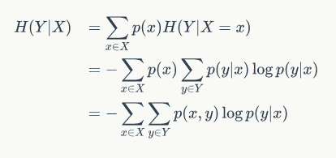

条件熵
  
作者：阿泽
链接：https://zhuanlan.zhihu.com/p/85731206
来源：知乎
著作权归作者所有。商业转载请联系作者获得授权，非商业转载请注明出处。
# 我的感觉
我感觉 ID3 C4.5 与CART 在结构上最大的区别在于, 有点像树与二叉树的区别, 树中每一个结点的分支是不固定的, 而二叉树中结点的分支只有两个, 分为左右各两个分支.
ID3 C4.5的分支是根据特征的取值来决定的，特征的取值可以有很多个，那就有很多分支，CART的分支是根据是否满足阈值（或者是否小于阈值）来进行二叉分支.

# 熵
条件熵 $H(Y|X)$ 表示在已知随机变量 $X$ 的条件下随机变量 $Y$ 的不确定性。
一般地，熵 $H(Y)$ 与条件熵 $H(Y|X)$ 之差称为互信息(mutual information)。

## 信息增益
**决策树学习中的信息增益等价于训练数据集中类与特征的互信息。**

决策树学习应用信息增益准则选择特征。

给定训练数据集 $D$ 和特征 $A$，经验熵 $H(D)$ 表示对数据集 $D$ 进行分类的不确定性。
而经验条件熵 $H(D|A)$ 表示在特征 $A$ 给定的条件下对数据集 $D$ 进行分类的不确定性。
那么它们的差，即信息增益，就表示由于特征 $A$ 而使得对数据集 $D$ 的分类的不确定性减少的程度。
显然，对于数据集 $D$ 而言，信增益依赖于特征，不同的特征往往具有不同的信息增益。
信息增益大的特征具有更强的分类能力。

**也可以换个角度理解, 要想信息增益最大, 由于 $H(D)$ 是定值, 那么特征 $A$ 必须使得 $H(D|A)$ 最小, 这样才能获得最大的信息增益值, 最小的 $H(D|A)$ 意味着特征A已知的情况下,样本集合 $D$ 的不确定性最小(分类更简单啦, 选择变少了)**

## 信息增益比
以信息增益作为划分训练数据集的特征，存在偏向于选择取值较多的特征的问题 (**如果特征的取值有很多可能,那么 $H(D|A)$ 的值就会偏小,可以自己假设一些例子来验证一下**)。使用信息增益比(information gain ratio）可以对这一问题进行校正。这是特征选择的另一准则。

## 基尼系数

# 1. ID3
ID3 算法是建立在奥卡姆剃刀（用较少的东西，同样可以做好事情）的基础上：越是小型的决策树越优于大的决策树。

1.1 思想
从信息论的知识中我们知道：信息熵越大，从而样本纯度越低，。ID3 算法的核心思想就是以信息增益来度量特征选择，选择信息增益最大的特征进行分裂。算法采用自顶向下的贪婪搜索遍历可能的决策树空间（C4.5 也是贪婪搜索）。 其大致步骤为：

1. 初始化特征集合和数据集合；
2. 计算数据集合信息熵和所有特征的条件熵，选择信息增益最大的特征作为当前决策节点；
3. 更新数据集合和特征集合（删除上一步使用的特征，并按照特征值来划分不同分支的数据集合）；
4. 重复 2，3 两步，若子集值包含单一特征，则为分支叶子节点。
5. 
1.2 划分标准
ID3 使用的分类标准是信息增益，它表示得知特征 A 的信息而使得样本集合不确定性减少的程度。

数据集的信息熵：

$$H(D)=-\sum_{k=1}^{K}\frac{|C_k|}{|D|}log_2\frac{|C_k|}{|D|}$$

其中 $C_k$ 表示集合 $D$ 中属于第 $k$ 类样本的样本子集 (假设集合中的样本由 $K$ 个类别）。

针对某个特征 A，对于数据集 $D$ 的条件熵 $H(D|A)$ 为：

$$\begin{aligned} H(D|A) & = \sum_{i=1}^{n}\frac{|D_i|}{|D|}H(D_i) \\ & =- \sum_{i=1}^{n}\frac{|D_i|}{|D|}(\sum_{k=1}^{K}\frac{|D_{ik}|}{|D_i|}log_2\frac{|D_{ik}|}{|D_i|})
\end{aligned}$$

其中 $C_k$ 表示 $D$ 中特征 $A$ 取第 $i$ 个值的样本子集 （假设特征 $A$ 可以有 $n$ 个取值）， $D_{ik}$ 表示 $D_i$ 中属于第 $k$ 类的样本子集。

信息增益 = 信息熵 - 条件熵：

$$Gain(D,A)=H(D)-H(D|A)$$
信息增益越大表示使用特征 A 来划分所获得的“纯度提升越大”。

1.3 缺点
ID3 没有剪枝策略，容易过拟合；
信息增益准则对可取值数目较多的特征有所偏好，类似“编号”的特征其信息增益接近于 1；
只能用于处理离散分布的特征；
没有考虑缺失值。