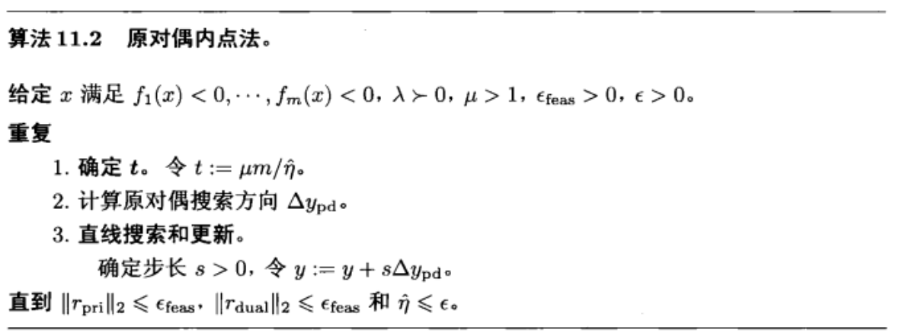

## 含不等式约束的优化问题的求解方法-内点法
**为什么凸优化只讨论含等式约束和不等式约束的优化问题, 因为不等式约束经过障碍法的处理都可以放到目标函数中去, 得到只留下等式约束的优化问题, 因此我们只需要关心含等式约束的优化问题.**
>We can view interior-point methods as another level in the hierarchy of convex optimization algorithms. Linear equality constrained quadratic problems are the simplest. For these problems the KKT conditions are a set of linear equations, which can be solved analytically. Newton’s method is the next level in the hierarchy. We can think of Newton’s method as a technique for solving a linear equality constrained optimization problem, with twice differentiable objective, by reducing it to a sequence of linear equality constrained quadratic problems. Interior-point methods form the next level in the hierarchy: They solve an optimization problem with linear equality and inequality constraints by reducing it to a sequence of linear equality constrained problems.
我们可以把内点法看作凸优化算法的另一个层次。
带线性等式约束的二次型问题是最简单的。对于这些问题，KKT条件是一组可以解析求解的线性方程组 (直接求解这个方程就可以得到整个问题的最优解)。
牛顿法是层次结构中的下一层。我们可以把牛顿法看作是一种求解具有二次可微目标的线性等式约束优化问题的技术，通过将其化为一系列线性等式约束的二次问题 (迭代求解,将问题归纳到带线性等式的二次型问题).
内点法是层次结构中的下一层:它们通过将具有线性等式和不等式约束的优化问题简化为一系列线性等式约束问题来解决该问题 (将问题缩放到牛顿法可以处理的范围)。 

 ```mermaid
    graph BT
    A[带等式约束的二次型优化]
    B["带等式约束的优化问题(目标函数二次可微)"]
    C["带不等式和等式约束的优化问题(目标函数二次可微)"]
    S1(求解KKT系统,即求解线性方程)
    S2(二阶近似目标函数,然后求解线性KKT系统)
    S3(障碍法将不等式约束放入目标函数,二阶近似目标函数,然后求解线性KKT系统)
    B-->|转化|A
    C-->|转化|B
    S1-.->|求解|A
    S2-.->|求解|B
    S3-.->|求解|C
 ```
---
### 优化过程
### 对数障碍 $\text{log barrier}$
首先, 介绍一下 $\text{log barrier}$ 方法:

$$
\begin{array}{lll}
\min & f_{0}(x) &\\
\text{s.t.} & f_{i}(x) \leq 0 &  i=1 \cdots m \\
            & Ax = b    &   \\ \tag{eq0}
 & \Downarrow & \\
\min &  f_{0}(x)+\sum_{i=1}^{m}-(1 / t) \log \left(-f_{i}(x)\right)
\\
\text{s.t.} &  A x=b
\end{array}
$$

这是一个惩罚的思想. 具体来说就是 $f_{i}(x) \rightarrow 0$ 时, $p^{*} \rightarrow+\infty$, 会让目标函数根本无法得到最优解, 就好像有一个“栅栏”一样, 阻止 $f_{i}(x)$ 趋近于 0, 让它只能小于0. 基于 $\text{log barrier}$ 方法, **我们之后所有的约束都只讨论等式约束, 不等式约束用 $\text{log barrier}$ 去掉.  即所有的凸问题都形如:**

$$
\begin{array}{lll}
\min &  f_{0}(x) & \\
\text {s.t. } & Ax=b & 
\end{array}
$$

由于 $-(1 / t) \log (-u)$ 是 $u$ 的单增凸函数, 上式中的目标函数是可微凸函数. 假定恰当的闭性条件成立，则可用 Newton 方法求解该问题. 
我们将函数

$$
\phi(x)=-\sum_{i=1}^{m} \log \left(-f_{i}(x)\right)
$$

$\operatorname{dom} \phi=\left\{x \in \mathbf{R}^{n} \mid f_{i}(x)<0, i=1, \cdots, m\right\}$ 称为原问题的**对数障碍函数或对数障碍**. 其定义域是满足原问题的严格不等式约束的点集. 不管正参数 $t$ 取什么值， 对于任意 $i$, 当 $f_{i}(x) \rightarrow 0$ 时，对数障碍函数将趋于无穷大. 并且, 我们可以知道当 $t$ 越来越大时, $\sum_{i=1}^{m}-(1 / t) \log \left(-f_{i}(x)\right)$ 会非常近似于指示函数($\text{indicator function}$), 即当 $f_{i}(x)<0$ 时, $\sum_{i=1}^{m}-(1 / t) \log \left(-f_{i}(x)\right) = 0$, 当 $f_{i}(x) = 0$ 时,$\sum_{i=1}^{m}-(1 / t) \log \left(-f_{i}(x)\right) = +\infty$. 为了以后简化符号，我们用 $t$ 乘目标函数，考虑等价问题

$$
\begin{array}{ll}
\min &t f_0(x)+\phi(x)\\ 
\text{s.t.}&Ax=b
\end{array}
\tag{1}
$$

$\phi(x)$ 的一阶导数和二阶导分别如下所示:

$$
\begin{aligned}
&\nabla\phi\left(x\right) =\sum_{i=1}^{m}\frac{1}{-f_{i}(x)}\nabla f_{i}(x),  \\
&\nabla^{2}\phi\left(x\right) =\sum_{i=1}^{m}{\frac{1}{f_{i}(x)^{2}}}\nabla f_{i}(x)\nabla f_{i}(x)^{T}+\sum_{i=1}^{m}{\frac{1}{-f_{i}(x)}}\nabla^{2}f_{i}(x). 
\end{aligned}
$$

### 内点法与对偶问题之间的关系
对任意 $t> 0$，我们用 $x^{*}\left(t\right)$ 表示问题 (1) 的解，称 $x^{*}\left(t\right), t>0$ 为中心点，将这些点的集合定义为问题 (1) 的中心路径。所有中心路径上的点由以下充要条件所界定: $x^*(t)$是严格可行的，即满足

$$
\left\{
\begin{array}{ll}
t\nabla f(x^{*}(t))-\sum_{i=1}^{m}{\frac{1}{f_{i}(x^{*}(t))}}\nabla f_{i}(x^{*}(t))+A^{T} \hat{\nu}=0 \quad \text{stationarity} \tag{2}\\
Ax^*\left(t\right)=b \quad  \text{primal feasibility}\\
f_{i}\left(x^{*}\left(t\right)\right)<0,i=1,\ldots,m \quad \text{primal feasibility}
\end{array}
\right. 
$$

对式 (2) 中的 stationarity 左右两边同时除以 $t$ 可以得到:

$$
\nabla f(x^{*}(t))-\sum_{i=1}^{m}{\frac{1}{t f_{i}(x^{*}(t))}}\nabla f_{i}(x^{*}(t))+\frac{A^{T} \hat{\nu}}{t}=0 \tag{3}
$$

可以导出中心路径的一个重要性质: 每个中心点产生对偶可行解, 因而给出最优值 $p^*$ 的一个下界。更具体地说，定义:

$$
\begin{aligned}
   \lambda_{i}^{*}(t) &=-\frac{1}{t f_{i}(x^{*}(t))},\quad i=1,\cdots,m,\\
   \nu^{*}(t) &=\hat{\nu}/t,
\end{aligned}
$$

我们要说明 $\lambda^{*}(t)$ 和 $\nu^{*}(t)$ 是对偶可行解。
首先, 由于 $f_i\left(x^{*}(t)\right)<0, i=1, \cdots, m$, 显然有 $\lambda^{*}(t) \succ 0$ 。将最优性条件 (3) 表示成

$$
\nabla f_0\left(x^{*}(t)\right)+\sum_{i=1}^m \lambda_i^{*}(t) \nabla f_i\left(x^{*}(t)\right)+A^T \nu^{*}(t)=0,
$$

可看出 $x^{*}(t)$ 使 $\lambda=\lambda^{*}(t), \nu=\nu^{*}(t)$ 时的 Lagrange 函数

$$
L(x, \lambda, \nu)=f_0(x)+\sum_{i=1}^m \lambda_i f_i(x)+\nu^T(A x-b)
$$

达到极小, 这意味着 $\lambda^{*}(t), \nu^{*}(t)$ 是对偶可行解。**另外, 这个 Lagrange 函数对应的原问题就是式 $(eq0)$**, 对偶函数 $g\left(\lambda^{*}(t), \nu^{*}(t)\right)$ 是有限的, 并且

$$
\begin{aligned}
g\left(\lambda^{*}(t), \nu^{*}(t)\right) &= \underset{x}{\inf} \; L(x,\lambda^{*}(t), \nu^{*}(t))\\
& =f_0\left(x^{*}(t)\right)+\sum_{i=1}^m \lambda_i^{*}(t) f_i\left(x^{*}(t)\right)+\nu^{*}(t)^T\left(A x^{*}(t)-b\right) \\
& =f_0\left(x^{*}(t)\right)-m / t. \qquad \left( \lambda_i^{*}(t)=-\frac{1}{t f_{i}(x^{*}(t))},  \quad \lambda_i^{*}(t) f_i\left(x^{*}(t)\right) = \frac{1}{t}\right)
\end{aligned}
$$

这表明 $x^{*}(t)$ 和对偶可行解 $\lambda^{*}(t), \nu^{*}(t)$ 之间的对偶间隙就是 $m / t$ 。作为一个重要的结果, 我们有

$$
\text{原问题的最优目标函数值}-\text{对偶问题的最优目标函数值之差} = f_0\left(x^{*}(t)\right)-p^{*} \leqslant m / t
$$

即 $x^{*}(t)$ 是和最优值偏差在 $m / t$ 之内的次优解。这个结论证实了前面提到的直观想 法: $x^{*}(t)$ 随着 $t \rightarrow \infty$ 而收敛于最优解。

### 基于 KKT 条件的解释
我们也可以将中心路径条件 (3) 解释为正常 KKT 最优性条件的连续变形。点 $x$ 等于 $x^{\star}(t)$ 的充要条件是存在 $\lambda, \nu$ 满足

$$
\left\{
\begin{aligned}
A x=b, \quad f_i(x)  \leqslant& 0, \quad i=1, \cdots, m \\
\lambda  \succeq & 0 \\
\nabla f_0(x)+\sum_{i=1}^m \lambda_i \nabla f_i(x)+A^T \nu =& 0 \\
-\lambda_i f_i(x)  =& 1 / t, \quad i=1, \cdots, m
\end{aligned} \tag{4}
\right.
$$

正常 KKT 条件和中心条件 (4) 的唯一不同在于互补性条件 $-\lambda_i f_i(x)=0$ 被条件 $-\lambda_i f_i(x)=1 / t$ 所替换。特别是, 对于很大的 $t, x^{\star}(t)$ 和对应的对偶解 $\lambda^{\star}(t), \nu^{\star}(t)$ “几乎” 满足问题 (eq0) 的 KKT 最优性条件.

### 原-对偶内点法
#### 微分
**微分就相当于对整个函数原来复杂的因变量与自变量的关系做了很大程度的简化, 将因变量与自变量之间的关系在很小的改变区间内近似为线性关系, 而这种线性关系的系数就是偏导数.** 例如:

$$
f(x,y) = x^2+y^2
$$

对上式左右求微分,可得:

$$
\begin{aligned}
   d(z) = d\left( f(x,y) \right)  = d(x^2+y^2)
   =2x dx +2y dy
\end{aligned}
$$

为了方便起见, 我们使用 $z$ 代替 $f(x,y)$, 这里的 $dx,dy, dz$ 分别表示在自变量 $x,y$ 上极小的改变量, 以及函数值 $z$ 上极小的改变量, 根据微分带给我们的信息, 当自变量 $x,y$ 发生微小改变时, 函数值 $z$ 的微小变化是关于自变量 $x,y$ 的线性函数, 且这个线性函数的系数就是 函数值 $z$ 分别关于自变量 $x,y$ 的偏导数.

$$
dz = \frac{\partial z}{\partial x} dx + \frac{\partial z}{\partial y} dy
$$

这样我们在各个因素改变很小的情况下, 将这个系统之间的函数关系简化为线性关系, 并根据偏导数得到系数.
#### 梯度 $\nabla f(x)$

对于实函数 $f$（即 $f:{\mathbf R}^{n}\rightarrow{\mathbf R}$ )，导数 $Df(z)$ 是 $1\times n$ 的矩阵，即行向量。它的转置称为函数的梯度:

$$
\nabla f(x)=Df(x)^T,
$$

这是一个（列）向量，即属于 $R^n$。它的分量是 $f$ 的偏导数.
**记住一点就行, 梯度$\nabla f(x)$的大小是和 $x$ 一样的**

#### 矩阵微分
该简单的方法主要用到了矩阵微分的方法，矩阵微分主要有以下几种:
- 加减乘运算，转置，求迹:
$$
\begin{gathered}
d(\mathbf{X} \pm \mathbf{Y})=d \mathbf{X} \pm d \mathbf{Y} \\
d(\mathbf{X Y})=(d \mathbf{X}) \mathbf{Y}+\mathbf{X}(d \mathbf{Y}) \\
d\left(\mathbf{X}^{\mathrm{T}}\right)=d(\mathbf{X})^{\mathrm{T}} \\
d \operatorname{tr}(\mathbf{X})=\operatorname{tr}(d \mathbf{X})
\end{gathered}
$$
- 求逆运算:
$$
d \mathbf{X}^{-1}=-\mathbf{X}^{-1} d \mathbf{X X}^{-1}
$$
简单证明:
$$
0=d \mathbf{X X}^{-1}=d \mathbf{X X}^{-1}+\mathbf{X} d \mathbf{X}^{-1}
$$
- 哈达玛积，也就是一般说的逐元素乘，即 $(\mathbf{A} \odot \mathbf{B})_{i j}=\mathbf{A}_{i j} \times \mathbf{B}_{i j}$ :
$$
d(\mathbf{X} \odot \mathbf{Y})=d \mathbf{X} \odot \mathbf{Y}+\mathbf{X} \odot d \mathbf{Y}
$$
- 逐元素函数，其中 $\sigma(\mathbf{X})_{i j}=\sigma\left(\mathbf{X}_{i j}\right)$
$$
d \sigma(\mathbf{X})=\sigma^{\prime}(\mathbf{X}) \odot d \mathbf{X}
$$
接下来将导数与微分联系起来。我们先考虑对于一个二元函数 $f(x, y)$ 导数与微分的联系:
$$
df=\frac{\partial f}{\partial x}dx+\frac{\partial f}{\partial y}dy
$$

对于一个函数矩阵 $f(X)$，类似的，有:

$$
df=\sum_{i,j}\frac{\partial f}{\partial\mathbf{X}_{ij}}d\mathbf{X}_{ij}
$$

写成矩阵形式就是

$$
d f=\mathrm{tr}\left(({\frac{\partial f}{\partial\mathbf{X}}})^{\mathrm{T}}d\mathbf{X}\right)
$$

注意到，如果矩阵降维成向量，上式子直接变成了 $d f=({\frac{\partial f}{\partial\mathbf{x}}})^{\mathrm{T}}d\mathbf{x}$
结合求迹的技巧，可以更加方便地计算求导

·标量求迹：$\alpha=\mathrm{tr}(\alpha)$
·转置：$\operatorname{tr}(\mathbf{A})=\operatorname{tr}(\mathbf{A}^{\mathrm{T}})$
·线性：$\operatorname{tr}(\mathbf{A}\pm\mathbf{B})=\operatorname{tr}(\mathbf{A})\pm\operatorname{tr}(\mathbf{B})$
·乘法交换：$\operatorname{tr}(\mathbf{A}\mathbf{B})=\operatorname{tr}(\mathbf{B}\mathbf{A})$


#### 牛顿法解方程

牛顿法（英语：Newton's method）又称为牛顿-拉弗森方法（英语：Newton-Raphson method），它是一种在实数域和复数域上近似求解方程的方法。方法使用函数 $f(x)$ 的泰勒级数的前面几项来寻找方程 $f(x)=0$ 的根。
首先，选择一个接近函数 $f(x)$ 零点的 $x_0$，计算相应的 $f(x_0)$ 和切线斜率 $f^\prime(x_0)$ (这里 $f^\prime$ 表示函数 $f$ 的导数）。然后我们计算穿过点 $(x_0, f(x_0))$ 并且斜率为 $f^{\prime}(x_0)$ 的直线和$x$ 轴的交点的 $x$ 坐标，也就是求如下方程的解:

$$
0=(x-x_0)\cdot f^\prime (x_0)+f(x_0)
$$

我们将新求得的点的 $x$ 坐标命名为 $x_1$，通常 $x_1$ 会比 $x_0$ 更接近方程 $f(x)=0$ 。因此我们现在可以利用 $x_1$ 开始下一轮迭代。迭代公式可化简为如下所示:

$$
x_{n+1}=x_n-\frac{f(x_n)}{f'(x_n)}
$$

已有证明牛顿迭代法的二次收敛必须满足以下条件:
(1) $f^\prime(x)\neq0$;对于所有 $x\in I$, 其中 $I$ 为区间 $[\alpha-r,\alpha+r]$, 且 $x_0$ 在区间其中 $I$ 内, 即 $r\geq |a-x_0|$的; 对于所有 $x\in I$, $f^{\prime\prime}$ 是连续的;
(2) $x_0$ 要足够接近 $\alpha$


#### 原-对偶内点法细节


如同障碍方法, 我们从修改的 KKT 条件 (4) 开始, 该条件可以表述为 $r_t(x, \lambda, \nu)=0$, 其中

$$
\mathbf{0} = r_t(x, \lambda, \nu) = \left[
   \begin{array}{c}
   r_{dual} \\
   r_{cent} \\
   r_{pri}
   \end{array}
\right]=
\left[\begin{array}{c}
\nabla f_0(x)+D f(x)^T \lambda+A^T \nu \\
-\operatorname{diag}(\lambda) f(x)-(1 / t) \mathbf{1} \\
A x-b
\end{array}\right]
\tag{5}
$$

并且 $t>0$. 此处的 $f: \mathbf{R}^n \rightarrow \mathbf{R}^m$ 和它的导数矩阵 $D f$ 由下式给出,

$$
f(x)=\left[\begin{array}{c}
f_1(x) \\
\vdots \\
f_m(x)
\end{array}\right], \quad D f(x)=\left[\begin{array}{c}
\nabla f_1(x)^T \\
\vdots \\
\nabla f_m(x)^T
\end{array}\right]
$$

如果 $x 、 \lambda 、 \nu$ 满足 $r_t(x, \lambda, \nu)=0$ (并且 $f_i(x)<0$ ), 则 $x=x^{\star}(t), \lambda=\lambda^{\star}(t), \nu=\nu^{\star}(t)$ 。 特别是, $x$ 是原可行的, $\lambda, \nu$ 是对偶可行的, 对偶间隙为 $m / t$ 。
我们将 $r_t$ 的第一块构件称为对偶残差:

$$
r_{\text {dual }}=\nabla f_0(x)+D f(x)^T \lambda+A^T \nu
$$

将中间构件称为中心残差, 即修改的互补性条件:

$$
r_{\text {cent }}=-\operatorname{diag}(\lambda) f(x)-(1 / t) \mathbf{1}
$$


将最后一块构件称为原残差:

$$
r_{\mathrm{pri}}=A x-b
$$

现在让我们固定 $t$, 考虑从满足 $f(x) \prec 0, \lambda \succ 0$ 的点 $(x, \lambda, \nu)$ 开始求解非线性方 程 $r_t(x, \lambda, \nu)=0$ 的 Newton 步径 (与 $\S 11.3 .4$ 不同, 这里不首先消去 $\lambda$ )。我们将当前点 和 Newton 步径分别记为

$$
y=(x, \lambda, \nu), \quad \Delta y=(\Delta x, \Delta \lambda, \Delta \nu)
$$

决定 Newton 步径的线性方程为

$$
r_t(y+\Delta y) \approx r_t(y)+D r_t(y) \Delta y=0
$$

即 $\Delta y=-D r_t(y)^{-1} r_t(y)$ 。基于 $x, \lambda$ 和 $\nu$, 我们有

$$
\left[\begin{array}{ccc}
\nabla^2 f_0(x)+\sum_{i=1}^m \lambda_i \nabla^2 f_i(x) & D f(x)^T & A^T \\
-\operatorname{diag}(\lambda) D f(x) & -\operatorname{diag}(f(x)) & 0 \\
A & 0 & 0
\end{array}\right]\left[\begin{array}{c}
\Delta x \\
\Delta \lambda \\
\Delta \nu
\end{array}\right]=-\left[\begin{array}{c}
r_{\text {dual }} \\
r_{\text {cent }} \\
r_{\text {pri }}
\end{array}\right] \tag{6}
$$

所调原对偶搜索方向 $\Delta y_{\mathrm{pd}}=\left(\Delta x_{\mathrm{pd}}, \Delta \lambda_{\mathrm{pd}}, \Delta \nu_{\mathrm{pd}}\right)$ 就是式 (6) 的解。

#### 详细拆解式(6)

$$
d\left(r_t(y)\right) = d \left(r_t(x, \lambda, \nu) \right)= d \left[\begin{array}{c}
\nabla f_0(x)+D f(x)^T \lambda+A^T \nu \\
-\operatorname{diag}(\lambda) f(x)-(1 / t) \mathbf{1} \\
A x-b
\end{array}\right], \tag{5}
$$

##### 式(5)第一行微分结果
首先看式(5)的第一行中的 $D f(x)^T \lambda$:

$$
D f(x)^{T}\lambda= \lambda_{1} \nabla f_{1}(x)+\lambda_{2} \nabla f_{2}(x)+\cdots+\lambda_m \nabla f_{m}(x) = \sum_{i=1}^{m} \lambda_i f_i(x)
$$

对上式求微分:

$$
\begin{aligned}
   d\left(\sum_{i=1}^{m} \lambda_i \nabla f_i(x)\right)  
   =& d(Df(x)^T \lambda) \quad \text{注意这里的 $x,\lambda$ 都是可微的, 且都是向量}\\
   =& d(Df(x)^T) \lambda + Df(x)^Td(\lambda) \quad \text{矩阵微分法则 $d(XY) = d(X)Y+Xd(Y)$} \\
   =& \sum_{i=1}^{m} \lambda_i \nabla^2 f_i(x) dx + Df(x)^T d\lambda
\end{aligned}
$$

因此式(5)的第一行完整微分结果是:

$$
\begin{aligned}
&d\left(\nabla f_{0}(x)+D f(x)^{T}\lambda+A^{T}\nu\right) \\
&= d\left(\nabla f_{0}(x)\right)+d\left(D f(x)^{T}\lambda\right) + d(A^{T}\nu) \\
&=\textcolor{blue}{\nabla^2 f_{0}(x) dx + \sum_{i=1}^{m} \lambda_i \nabla^2 f_i(x) dx + Df(x)^T d\lambda +A^T d \nu}
\end{aligned}
$$

##### 式(5) 第二行微分结果
首先 $\text{diag}(\lambda) f(x)$ 的结果为:

$$
\sum_{i=1}^{m} \lambda_i f_i(x)= 
\text{diag}(\lambda) f(x) = 
\left[
\begin{matrix}
\lambda_{1} &0&0\\ 
\vdots& \lambda_{2} &\vdots \\
0&\cdots& \lambda_{m} 
\end{matrix}
\right]
\left[
\begin{matrix}
 f_{1}(x)\\
f_{2}(x) \\
\vdots\\
f_{m}(x)
\end{matrix}
\right]
$$

式(5) 的第二行完整微分结果是:

$$
\begin{aligned}
   & d \left( -\text{diag}(\lambda) f(x)  - (1 / t) \mathbf{1} \right) \\
   &= \lambda_{i}\nabla f_{i}(x) dx+
   \left[
   \begin{matrix}
   f_{1}(x)&0&0\\ 
   \vdots&f_{2}(x)&\vdots \\
   0&\cdots&f_{m}(x)
   \end{matrix}
   \right]
   d
   \left[
   \begin{matrix}
   \lambda_{1}\\
   \lambda_{2} \\
   \vdots\\
   \lambda_{m}
   \end{matrix}
   \right] \\
   &=\textcolor{blue}{\lambda_{i} \nabla f_{i}(x)d x+ \text{diag}(f(x))d\lambda}
\end{aligned}
$$

##### 式(5) 第三行的微分结果

$$
d\left(Ax-b\right) = \textcolor{blue}{Adx}
$$

### 最终结果
将每一行的微分结果结合起来, 写成矩阵乘法的形式, 就构成了式(6), 注意, 式(6)中 $[\Delta x, \Delta \lambda, \Delta \nu]$ 就表示这里的 $[dx,d\lambda,d\nu]$

原搜索方向和对偶搜索方向通过系数矩阵和残差而互相耦合。例如, 原搜索方向 $\Delta x_{\mathrm{pd}}$ 依赖于对偶变量 $\lambda$ 和 $\nu$ 以及原变量 $x$ 的当前值。还要看到, 如果 $x$ 满足 $A x=b$, 即原可行性残差 $r_{\mathrm{pri}}$ 等于 0 , 那么就有 $A \Delta x_{\mathrm{pd}}=0$, 此时 $\Delta x_{\mathrm{pd}}$ 是一个 (原) 可行方向: 对任何 $s, x+s \Delta x_{\mathrm{pd}}$ 都将满足 $A\left(x+s \Delta x_{\mathrm{pd}}\right)=b$.


https://zhuanlan.zhihu.com/p/264515249